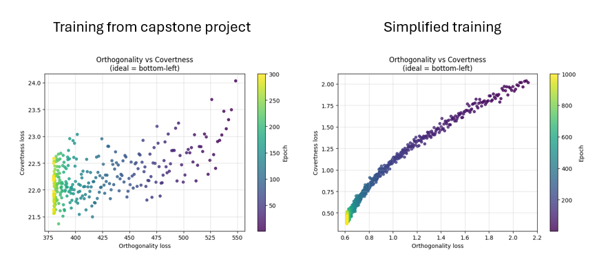
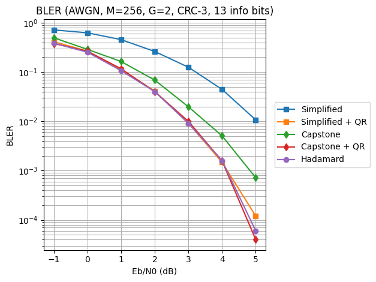
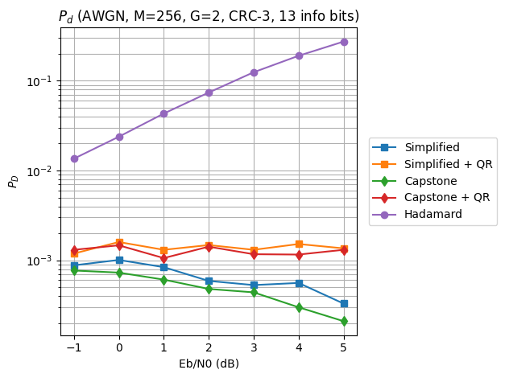

# Follow-up on BOSS Codes for LPD Acoustic Communications
The original version of this README is in the repository as a PDF. This one is shorter due to equation rendering issues.

This repository consists of the code used for my original capstone project about block orthogonal sparse superposition (BOSS) codes and my independent follow-up after the project was over.

BOSS codes are generated using a dictionary matrix whose column vectors are linearly combined. In the original capstone project which I did with two teammates, we created a dictionary containing two sub-matrices that were constructed from wave and wind audio frames, so that the column vectors of each matrix could serve as components of codewords AND waveforms of ambient sound for LPD communications.

After that I wanted to see if the process could be simplified without compromising block error and detection rates, and also improve the source code to be a bit more intuitive for future uses. I found out my simplified version works as well as the encoder if both encoders are post-processed via QR decomposition for lower BLER. Without QR processing, the original encoder both shows lower BLER and probability of detection compared to the simplified version. 
## How BOSS Codes Work
Block orthogonal sparse superposition (BOSS) codes were introduced by Han et al. for ultra-reliable low latency (URLLC) communications. [1][2]

BOSS codes combine encoding and modulation by using the bits to combine column vectors of symbols from a selected square sub-matrix, and the bit budget is determined by the information required to decide what vectors to decide from which  sub-matrix and how to combine them.

For AWGN, the received signal is decoded in two stages (sparse message vector recovery and block index recovery). Decoding performance can be increased even further by adding cyclic redundancy checks (CRC) in conjunction with MAP-list decoding.

## The Simplified Encoder

### Initialization
Not much has changed from the original implementation. Each sub-matrix for the encoder's dictionary is initialized using audio frames, by mixing an orthogonal basis obtained via PCA, with spectral correction using the PSDs of its target ambient sound.

### Training
My simplified version uses two loss terms for covertness and one term for orthogonality. 

The capstone project's training process also included three other loss terms that involved STFT comparisons, a pretrained classifier, and the cross correlation between different sub-matrices. a Pareto curve of BLER and probability of detection ($P_D$) was also plotted to pick the best encoder. In the simplified follow-up, features were either removed or modified primarily to see how much I could get away with simplicity, and additionally for stable gradients over time.

| Loss Term | Original Capstone Encoder | Simplified Encoder |
|---|---|---|
| **PSD** |MAE between a codeword's PSD and the average frame PSD, batch-averaging after comparison.|MSE between batch-averaged codeword PSD and the average frame PSD, modified for smoother and predictable gradient changes.  |
| **Mel** |MAE between the Mel spectrograms of a codeword and random audio frames, batch-averaging after comparison.|MSE between the Mel spectrograms of batch averaged codewords and the average frame Mel spectrogram.|
| **STFT** | Comparison between the STFTs of two random codewords.|Removed for simplicity.|
| **Classifier** |Cross-entropy of a pre-trained sub-matrix classifier.|Removed for simplicity.|
| **Inter-block** | MSE of the entries of $\mathbf{U}_1^\intercal\mathbf{U}_2$  |Removed because this loss can't distinguish identical and distinct pairs in some cases. (e.g. $\mathbf{U}_1^\intercal\mathbf{U}_2$ both have a squared Frobenius norm of $M$ when $\mathbf{U}_1=\mathbf{U}_2$ AND when $\mathbf{U}_2=\mathbf{P}\mathbf{U}_1$ where $\mathbf{P}$ is a permutation matrix)|
| **Orthogonality** |MSE of the entries of $\mathbf{U}_g^\intercal\mathbf{U}_g$ for each $g$  | Another $M$ is multiplied to the loss to represent average column-wise MSE. |

After training, in the original capstone project, BLER and probability of detection ($P_D$) were measured for all intermediate dictionaries in each epoch and plotted to identify a Pareto front with the best encoder. In the follow-up this process was removed to reduce computation time.
### QR Decomposition

A square matrix can be decomposed into a multiplication of two matrices $\mathbf{Q}$ and $\mathbf{R}$, where $\mathbf{Q}$ is an orthonormal basis obtained via a Gram-Schmidt process that starts with the first column vector, and $\mathbf{R}$ is an upper triangular matrix. To compensate for a simpler training method I increased the number of epochs to make the sub-matrices closer to orthogonality, which should theoretically prevent too much waveform differences between $\mathbf{Q}$ and $\mathbf{U}$. In the simplified version of this project, QR decomposition is functionally necessary as the raw trained encoder has significantly higher BLER compared to its capstone counterpart.

## Simulation Results

### Parameters and Assumptions

5 encoders were compared for BLER and $P_D$
- `encoder_simplified_no_qr`
- `encoder_simplified_qr`
- `encoder_capstone_no_qr`
- `encoder_capstone_qr`
- `encoder_hadamard`: This encoder uses a Hadamard matrix and its column-permutated copies for the dictionary matrix.

The encoders in the simulation use the following parameters 
- Codeword length: $M=256$ 
- Number of sub-matrices: $G=2$
- Number of layers: $L =2$
- Non-zero coefficients per layer: $K_1 = K_2 =1$
- Alphabet for each layer: $\mathcal{A}_1=\{1\}$, $\mathcal{A}_2=\{-1\}$
- CRC polynomial: $1011$

As for the channel and decoder
- Channel type: AWGN
- $E_b/N_0$ was measured at integer dB values between -1 and 5dB.
- MAP-list size: $S=4$
- CRC polynomial: $1011$

The probability of detection $P_D$ was defined as the probability that the $L^2$ distance between the normalized PSD of a received signal and the normalized average PSD of its corresponding sound frames passes a threshold. This threshold, while in the original capstone project was defined as the $\mu+2\sigma$ value of the encoder's codeword PSD distribution, was modified to be dependent on the quantile $Q_{1-P_{FA}}$ derived from audio frames and a fixed false alarm rate $P_{FA}$. The idea of implementing a false-alarm-rate-based threshold was inspired by a review written by R. Diamant and L. Lampe [3]

Ambient wave and wind recordings were obtained from Freesound. [4] [5]

### Training Results

### BLER
| $E_b/N_0$   (dB)| Simplified (no QR) | Capstone (no QR)|Simplified (QR) | Capstone (QR) | Hadamard |
|---|---|---|---|---|---|
|-1|0.7180 (359/500)|0.4973 (373/750)|0.4133 (310/750)|0.3800 (285/750)|0.3867 (290/750)|
|0|0.6260 (313/500)|0.2890 (289/1000)|0.2670 (267/1000)|0.2650 (265/1000)|0.2530 (253/1000)|
|1|0.4560 (342/750)|0.1640 (287/1750)|0.1124 (281/2500)|0.1169 (263/2250)|0.1068 (267/2500)|
|2|0.2620 (262/1000)|0.0688 (258/3750)|0.0411 (257/6250)|0.0400 (260/6500)|0.0402 (261/6500)|
|3|0.1255 (251/2000)|0.0198 (252/12750)|0.0092 (252/27500)|0.0100 (250/25000)|0.0091 (251/27500)|
|4|0.0445 (256/5750)|0.0051 (250/49250)|0.0015 (74/50000)|0.0016 (79/50000)|0.0016 (80/50000)|
|5|0.0107 (252/23500)|0.0007 (36/50000)|0.0001 (6/50000)|0.0000 (2/50000)|0.0001 (3/50000)|

### Probability of Detection
| $E_b/N_0$   (dB)| Simplified (no QR) | Capstone (no QR)|Simplified (QR) | Capstone (QR) | Hadamard |
|---|---|---|---|---|---|
|-1|0.0009 (88/100000)|0.0008 (77/100000)|0.0012 (119/100000)|0.0013 (131/100000)|0.0136 (1357/100000)|
|0|0.0010 (101/100000)|0.0007 (73/100000)|0.0016 (160/100000)|0.0015 (147/100000)|0.0238 (2383/100000)|
|1|0.0008 (84/100000)|0.0006 (61/100000)|0.0013 (131/100000)|0.0011 (106/100000)|0.0432 (4318/100000)|
|2|0.0006 (59/100000)|0.0005 (48/100000)|0.0015 (148/100000)|0.0014 (142/100000)|0.0740 (7404/100000)|
|3|0.0005 (53/100000)|0.0004 (44/100000)|0.0013 (131/100000)|0.0012 (117/100000)|0.1246 (12461/100000)|
|4|0.0006 (56/100000)|0.0003 (30/100000)|0.0015 (152/100000)|0.0012 (116/100000)|0.1901 (19012/100000)|
|5|0.0003 (33/100000)|0.0002 (21/100000)|0.0014 (136/100000)|0.0013 (131/100000)|0.2736 (27357/100000)|

## Conclusion
The encoder obtained from this simplified follow up shows comparable BLER and probability of detection to its capstone equivalent IF QR decomposition is applied afterward. Without this post processing, the capstone's encoder shows much better performance, which may be due to either better loss functions or best epoch selection from the BLER vs $P_D$ Pareto front.

Improving the training method, a better way to accurately represent ambient sound with a small number of symbols, a better definition of $P_D$, and simulations with harsher channels would make this project more applicable to LPD communications.

## References and Audio Sources

### References

[1] D. Han, J. Park, Y. Lee, H. V. Poor, and N. Lee, “Block Orthogonal Sparse Superposition Codes for Ultra-Reliable Low-Latency Communications,” IEEE Trans. Commun., vol. 71, no. 12, pp. 6884–6897, Dec. 2023, doi: 10.1109/TCOMM.2023.3317912.

[2] D. Han, B. Lee, M. Jang, D. Lee, S. Myung, and N. Lee, “Block Orthogonal Sparse Superposition Codes for $\mathrm{L}^3$ Communications: Low Error Rate, Low Latency, and Low Transmission Power,” IEEE J. Sel. Areas Commun., doi: 10.1109/JSAC.2025.3531569.

[3] R. Diamant and L. Lampe, "Low Probability of Detection for Underwater
Acoustic Communication: A Review," *IEEE Access*, vol. 6, pp. 19099–19112,
2018, doi: 10.1109/ACCESS.2018.2818110.

### Audio Sources

[4] YevgVerh, "Ocean_coast_04_092025_0659AM," Freesound, CC0. [Online]. Available: <https://freesound.org/people/YevgVerh/sounds/827530/>

[5] craigsmith, "Cold Day Wind," Freesound, CC0. [Online]. Available: <https://freesound.org/people/craigsmith/sounds/817182/>

## Disclosure

- In contrast to the capstone, the follow-up is an independent project unaffiliated with any supervisor or institution. 
- The source code was made with a mix of recycled code from the original capstone, generative AI and substantial human review and modification.
